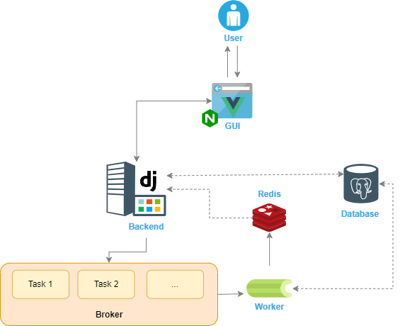

# Solution

## Design

**Figure 1: Design overview**

The goal of that project is to prepare a simple application that will comply with the requirements below but also be well-designed in regard to simplicity, maintainability, and performance. 

The initial setup will be used for that solution with only one difference, which will be the additional Docker container for the Frontend (GUI) part of the project. The orchestration of the containers will be extended and improved with automatic procedures for a better development experience.

Users will be able to perform all the mentioned actions in the requirements below and more, but the backend will have a caching mechanism that will prevent unnecessary calls to the database and will improve the response time of `GET` requests to the backend. Caching will offload the backend and the application automatically will be able to handle more user requests without the introduction of load balancing.
If it’s necessary to reduce latency and maximize the throughput of the application at some point we could easily implement load balancing in the NGINX configuration which also serves the UI and can play as a reverse proxy.

The figure above illustrates how celery works with the Django backend, where the backend acts as a producer and workers as consumers waiting for tasks to be put in a queue so they can be consumed. For storage of tasks until consumed and to persist results of the task we use Redis.

## Implementation approach

### Steps
* Design data flow (what type of information will be stored and where)
* Specifications about models and views
* Implement REST API with Django REST Framework
* Integration with Redis via Celery
* Testing backend implementation
* Create new Docker container for Frontend Client (GUI)
* Implement initial structure, state management, and routing
* Implement a client to handle HTTP requests to Redis
* Finalize UI/UX 
* Simplify docker composition and orchestration

_NOTE: Dockerizing the application makes it more suitable for faster CI/CD implementation_

## Solution

### Setup
The application can be started by `docker-compose up` or use a `make` command for cleaning and a fresh start of the application like `make docker-reset-dev` which cleans only the containers and volumes related to that project.

### Functionality
There is additional functionality to the already defined and implemented requirements from the section below:
* Users can work with any *.csv content (not limited to the structure which was given at the beginning)
* *.csv documents can also be updated from the Table view
* *.csv documents can be removed from the application
* Enrichment of *.csv documents was extended to be able to handle also up to two Key Field pairs (it’s demonstrated also in the demo below)

### API sources for enriching existing data
* https://jsonplaceholder.typicode.com/posts/
* https://jsonplaceholder.typicode.com/users/

